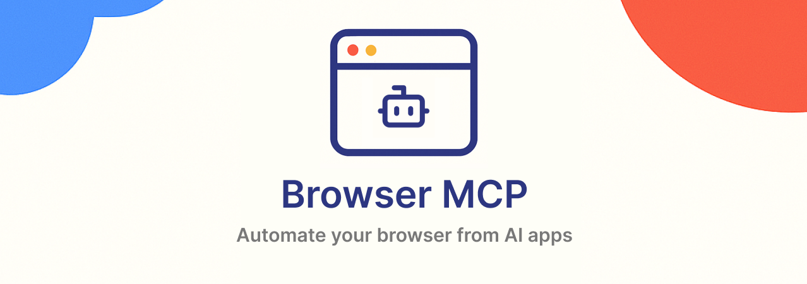

<a href="https://browsermcp.io">
  
</a>

<h3 align="center">Browser MCP</h3>

<p align="center">
  Automate your browser with AI.
  <br />
  <a href="https://browsermcp.io"><strong>Website</strong></a> 
  •
  <a href="https://docs.browsermcp.io"><strong>Docs</strong></a>
</p>

## About

Browser MCP is an MCP server + Chrome extension that allows you to automate your browser using AI applications like VS Code, Claude, Cursor, and Windsurf.

## Features

- ⚡ Fast: Automation happens locally on your machine, resulting in better performance without network latency.
- 🔒 Private: Since automation happens locally, your browser activity stays on your device and isn't sent to remote servers.
- 👤 Logged In: Uses your existing browser profile, keeping you logged into all your services.
- 🥷🏼 Stealth: Avoids basic bot detection and CAPTCHAs by using your real browser fingerprint.

## Setup

Browser MCP has two parts that run together:

```
AI app ⇄ (stdio) ⇄ MCP server (this repo) ⇄ (WebSocket 127.0.0.1:9009) ⇄ Chrome extension ⇄ tab
```

1. Install the Browser MCP Chrome extension.
2. Add the MCP server to your AI app. For example, in `~/.cursor/mcp.json`:

   ```json
   {
     "mcpServers": {
       "browsermcp": {
         "command": "npx",
         "args": ["--yes", "github:ngxuanth/bmcp#v0.1.5"],
         "env": {
           "BMCP_UPLOAD_DIR": "/path/to/uploads"
         }
       }
     }
   }
   ```

   With Claude Code:

   ```sh
   claude mcp add browsermcp -e BMCP_UPLOAD_DIR=/path/to/uploads -- npx --yes github:ngxuanth/bmcp#v0.1.5
   ```

3. Open the tab to automate, click the extension icon and press **Connect**.

Only one server can talk to an extension at a time: starting a new one stops any server already listening on its port (unless `BMCP_NO_KILL` is set).

To automate several Chrome profiles at once, give each profile its own port: run one server per profile with `BMCP_WS_PORT`, and point that profile's extension at the same port by running `chrome.storage.local.set({ wsPort: <port> })` in the extension's service worker console (`chrome://extensions` → Browser MCP → *service worker*).

### Environment variables

| Variable            | Description                                                                                                                  |
| ------------------- | ---------------------------------------------------------------------------------------------------------------------------- |
| `BMCP_UPLOAD_DIR`   | Directory whose files `browser_upload_file` may attach. Uploads are disabled when unset. Hidden files are never uploaded.    |
| `BMCP_EXTENSION_ID` | Only accept connections from this extension ID (see `chrome://extensions`). When unset, any Chrome extension can connect.    |
| `BMCP_WS_PORT`      | WebSocket port the extension connects to. Defaults to `9009`.                                                                |
| `BMCP_NO_KILL`      | When set, fail if the port is busy instead of killing the process listening on it.                                           |

## Tools

`browser_navigate`, `browser_go_back`, `browser_go_forward`, `browser_snapshot`, `browser_click`, `browser_drag`, `browser_hover`, `browser_type`, `browser_select_option`, `browser_press_key`, `browser_wait`, `browser_get_console_logs`, `browser_screenshot`, `browser_upload_file`, `browser_evaluate`.

## Development

```sh
npm install
npm run build      # outputs dist/index.js
npm run typecheck
```

To run a local build, point your MCP config at `node /path/to/bmcp/dist/index.js`.

The server was extracted from a monorepo; the workspace packages it used (`@repo/*`, `@r2r/messaging`) are replaced by local copies in `shims/`, mapped in `tsconfig.json`.

`npm pack` builds a tarball that can also be run with `npx --yes ./browsermcp-mcp-<version>.tgz`, and `manifest.json` packages the server for Claude Desktop with `npx @anthropic-ai/dxt pack`.

## Credits

Browser MCP was adapted from the [Playwright MCP server](https://github.com/microsoft/playwright-mcp) in order to automate the user's browser rather than creating new browser instances. This allows using the user's existing browser profile to use logged-in sessions and avoid bot detection mechanisms that commonly block automated browser use.
